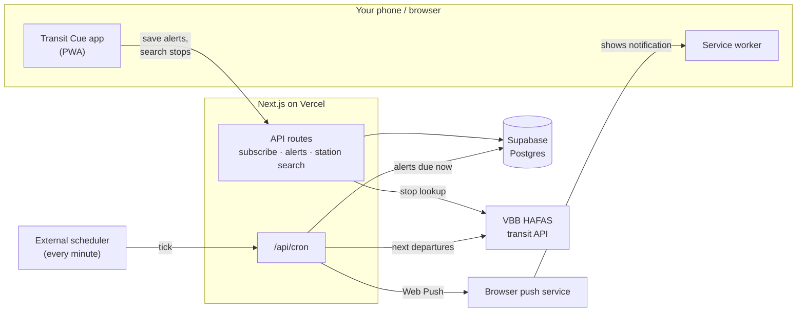

# Transit Cue

Transit Cue is a small web app that tells you when to leave for your commute in Berlin and Brandenburg.

Pick a departure stop, a destination and a time. At that time each day, your phone or browser gets a notification with the next three departures:

> **Eberswalder Straße → Nordbahnhof**
> M10 · 08:15 · on time
> M10 · 08:32 · on time
> M10 · 08:47 · +3 min

That way you won't run for a tram that has already left, and you'll know your options if you miss the next one.

## Features

- **Live departures** from the VBB (Berlin/Brandenburg) transit network, including delays.
- **Up to 5 alerts**, each with its own route, time and repeat days.
- **Pause alerts** temporarily without deleting them.
- **No account needed.** Your alerts are tied to your browser, and nothing asks for your name or email.
- **Installable.** Add it to your home screen like a native app. On iPhone this step is required, because iOS only delivers web notifications to installed apps.

## How it works



1. When you turn on notifications, your browser registers for Web Push. The app saves your alerts against a random ID stored in your browser.
2. Once a minute, an external scheduler calls the app's cron endpoint.
3. For every alert due that minute, the server looks up the next departures from VBB and sends a push notification to your device.

## Contributing

**Stack:** Next.js 16 (App Router) · React 19 · TypeScript · Tailwind CSS v4 · Supabase (Postgres) · `web-push` (VAPID) · `vbb-hafas` · `zod` · `pino` · pnpm 11. The app is hosted on Vercel, and database migrations run through GitHub Actions.

**Prerequisites:** Node.js 20+, pnpm 11 (`corepack enable`), and Docker for the local Supabase stack.

```bash
pnpm install
pnpm setup                     # generate a VAPID key pair
cp .env.example .env.local     # fill in VAPID keys, CRON_SECRET, SUPABASE_URL/_SERVICE_ROLE_KEY
pnpm exec supabase start       # local Postgres + Studio (Docker)
pnpm exec supabase db reset    # apply migrations + seed
pnpm dev                       # https://localhost:3000 (HTTPS, required for push)
pnpm dev:cron                  # optional, in a 2nd terminal: fires /api/cron every minute
```

The local Supabase credentials, the migration workflow and CI deploys are described in [`supabase/README.md`](supabase/README.md).

| Script | Does |
| --- | --- |
| `pnpm dev` | dev server over HTTPS |
| `pnpm dev:cron` | simulate the once-a-minute cron trigger locally (`CRON_URL`/`PORT` override the target) |
| `pnpm build` / `pnpm start` | production build / serve it |
| `pnpm lint` | ESLint |
| `pnpm setup` | generate VAPID keys |

**Deploying your own instance:** import the repo into Vercel and set the same env vars there. Add `SUPABASE_ACCESS_TOKEN`, `SUPABASE_PROJECT_ID` and `SUPABASE_DB_PASSWORD` as GitHub Action secrets so migrations apply on merge to `main`. Then point a scheduler such as [cron-job.org](https://cron-job.org) at `https://<your-domain>/api/cron` every minute, with the header `Authorization: Bearer <CRON_SECRET>`. Vercel's Hobby cron runs at most once a day, which is why the scheduler lives outside Vercel.
